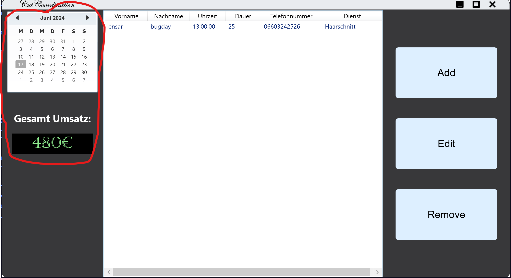
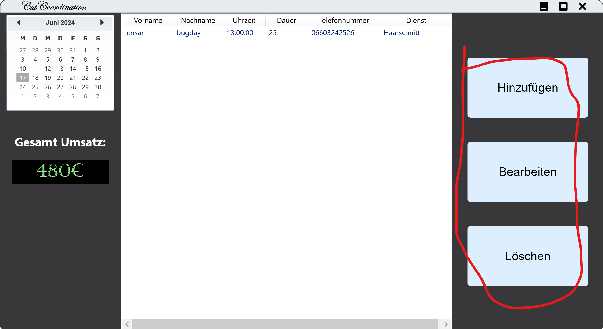
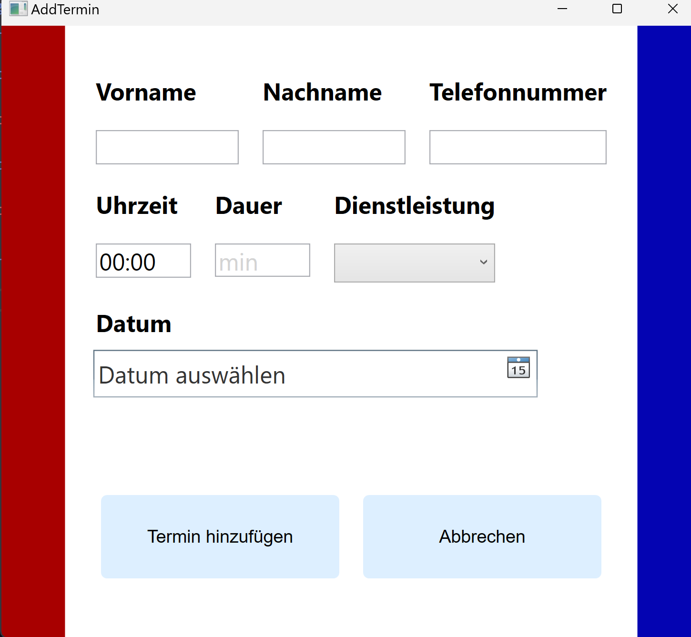
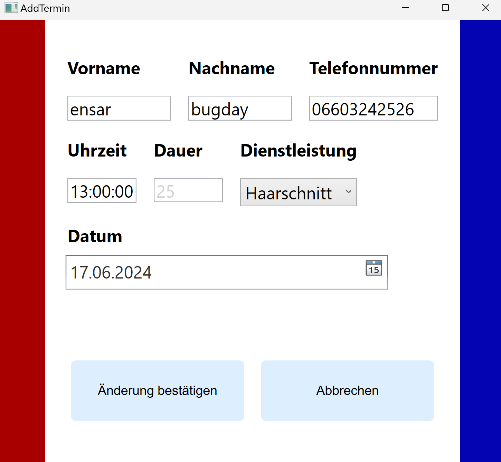

So sieht das Programm aus wenn es gestartet wurde

Bei der roten Markierung sieht man den Kalender, wählt man ein Datum aus so kriegt man die dementsprechenden Termine. Beim starten wird automatisch das heutige Datum angezeigt.

Drunter sieht man den Gesamtumsatz

Rechts sieht man die Buttons die selbsterklärend sind

so sieht unser window aus wenn man hinzufügen klickt

und so bei bearbeiten

